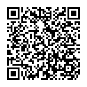
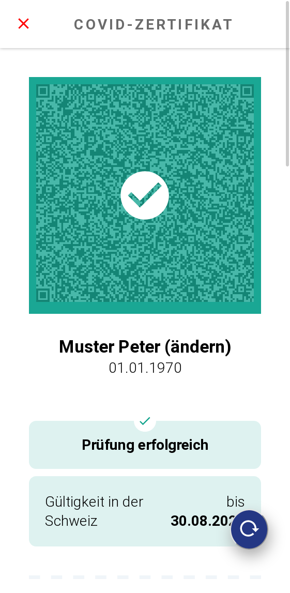

# Swiss Covid App Simulator

This is a simulation of the Swiss Covid Certificate with a dummy QR-code that turns green when pressed checking button. It will look and behave like the Swiss Covid Certificate, except that the certifiate is not valid. That allows non-vaccinated and untested persons to see, how their certificate would look like. This app is for demonstration purpose only, not a replacement to the real app.

Dies ist eine Simulation der Schweizer Covid Zertifikat App mit einem dummy QR-code, der grün wird, wenn man auf den prüfen Knopf drückt. Es sieht aus und verhält sich wie die echte Covid Zertifikat App, ausser dass der QR-Code kein gültiges Zertifikat enthält. So können auch ungeimpfte und ungetestete sehen, wie ein Zertifikat für sie aussehen würde. Diese App ist nur zu Demonstrationszwecken gedacht und ersetzt knicht die offizielle App.

## Test the App

Test it on: https://mwaeckerlin.github.io/swiss-covid-certificate/

Scan to load App: 

## Screenshot

